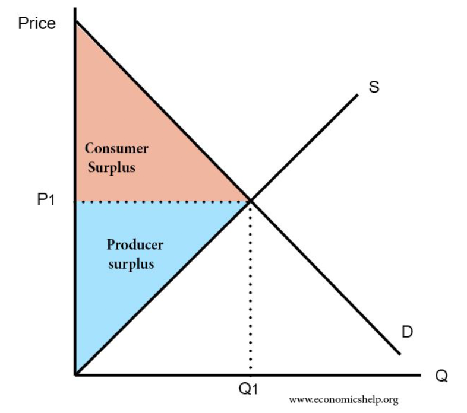

# Airbnb's Consumer Surplus

Capstone Project for New York University's Center for Data Science: Introduction to Data Science

## Directory Structure
`Code` contains code used in this project

`Images` contains images and statistical graphs produced

`Paper` contains the final write up with methods and results used for this project

`Presentation` contains the PDF presentation file

# Introduction
Can we measure Airbnb as an innovation?

Welfare (Consumer Surplus) is a measure of additional benefit consumer receive because they’re paying less for something than what they are willing to pay

Purpose: Show regulators in $ amount how much welfare AirBnB generates in NYC market

The Consumer Surplus Diagram

Three Critical Variables
1. Price

2. Quantity Demanded

3. Willingness to Pay
